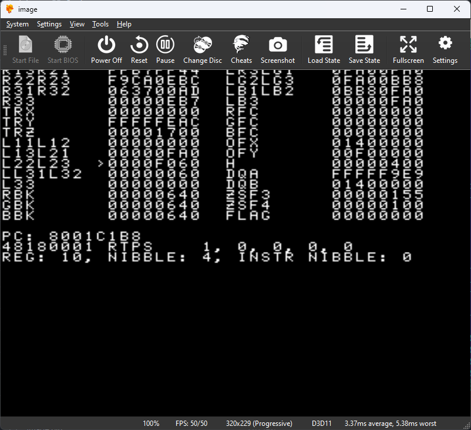

# GTETest

Program for testing GTE instructions.



The program is intended to be run from a CD-ROM. It includes the source code (PsyQ 4.6 is required for compilation), an executable file and a ready-made image for burning to CD-ROM.

And what use cases would this program even have? 
- Check how GTE instructions are executed with different set opcode bits on different CPUs. (those that are usually preset to certain values)
- Check the emulator with a real console.
- Use as a template to create similar utilities for other PSX tests.

Controls in the program:
- Left, Right - Change the bit number of the register
- Up, Down - Select register
- SELECT - Choice between Data and Control registers
- R1, R2 - Selecting the instruction bit number
- L1 - Increase the bit of the selected register by 1
- L2 - Increase the instruction code bit by 1
- START - Starts a GTE instruction to execute.

Before executing an instruction the program updates the GTE registers, and executes the selected instruction. If the instruction is not a GTE instruction it is not executed. Once executed, all GTE registers are copied back for display on the screen.

A list of known GTE instructions (bits):

```
     -----------------------------------------------------------------------------------------------
    |31|30|29|28|27|26|25|24|23|22|21|20|19|18|17|16|15|14|13|12|11|10|09|08|07|06|05|04|03|02|01|00|
    |-----------------------------------------------------------------------------------------------|
    | 0  1  0  0  1  0|       OP2       |SF| MX  |  V  | CV  |  LM    | 0  0  0  0|      OP1        |
     -----------------------------------------------------------------------------------------------

    RTPS   cop2 0x0180001 = 0100.10 10.0001. 1000.0000.00 00.00 00.0001
    NCLIP  cop2 0x1400006 = 0100.10 11.0100. 0000.0000.00 00.00 00.0110
    OP     cop2 0x170000c = 0100.10 11.0111. 0000.0000.00 00.00 00.1100
    DPCS   cop2 0x0780010 = 0100.10 10.0111. 1000.0000.00 00.00 01.0000
    INTPL  cop2 0x0980011 = 0100.10 10.1001. 1000.0000.00 00.00 01.0001
    MVMVA  cop2 0x0400012 = 0100.10 10.0100. 0000.0000.00 00.00 01.0010
    NCDS   cop2 0x0e80413 = 0100.10 10.1110. 1000.0000.01 00.00 01.0011
    CDP    cop2 0x1280414 = 0100.10 11.0010. 1000.0000.01 00.00 01.0100
    NCDT   cop2 0x0f80416 = 0100.10 10.1111. 1000.0000.01 00.00 01.0110
    NCCS   cop2 0x108041b = 0100.10 11.0000. 1000.0000.01 00.00 01.1011
    CC     cop2 0x138041c = 0100.10 11.0011. 1000.0000.01 00.00 01.1100
    NCS    cop2 0x0c8041e = 0100.10 10.1100. 1000.0000.01 00.00 01.1110
    NCT    cop2 0x0d80420 = 0100.10 10.1101. 1000.0000.01 00.00 10.0000
    SQR    cop2 0x0a00428 = 0100.10 10.1010. 0000.0000.01 00.00 10.1000
    DCPL   cop2 0x0680029 = 0100.10 10.0110. 1000.0000.00 00.00 10.1001
    DPCT   cop2 0x0f8002a = 0100.10 10.1111. 1000.0000.00 00.00 10.1010
    AVSZ3  cop2 0x158002d = 0100.10 11.0101. 1000.0000.00 00.00 10.1101
    AVSZ4  cop2 0x168002e = 0100.10 11.0110. 1000.0000.00 00.00 10.1110
    RTPT   cop2 0x0280030 = 0100.10 10.0010. 1000.0000.00 00.00 11.0000
    GPF    cop2 0x190003d = 0100.10 11.1001. 0000.0000.00 00.00 11.1101
    GPL    cop2 0x1a0003e = 0100.10 11.1010. 0000.0000.00 00.00 11.1110
    NCCT   cop2 0x118043f = 0100.10 11.0001. 1000.0000.01 00.00 11.1111
```

Known glitches and flaws:
- No highlighting of the selected register bit and instruction;

Changes:
- In version 0.1 I forgot to set the COP2 Usable bit in the STATUS register.
- In version 0.2 the controller is adequately handled.
- The version 0.3 (thanks to @edgbla) has no jittery buttons and proper screen resolution.

Comments:
To compile the program change the paths in BUILD.BAT and MAIN.INL, then run BUILD.BAT, then run CONVERT.BAT in DOSBox.

org.
Last Modified: 20 Jul 2011
